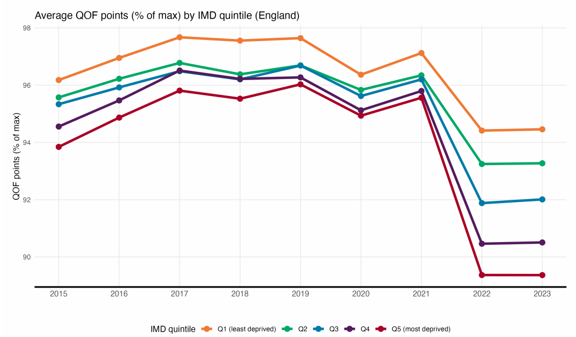
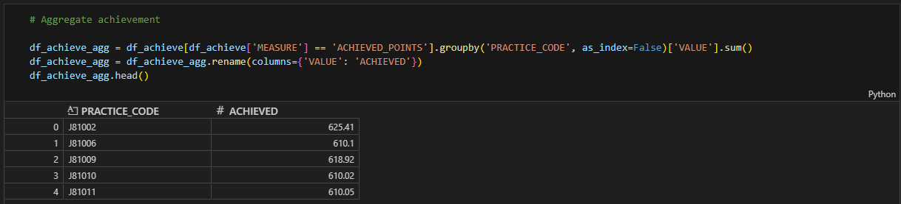
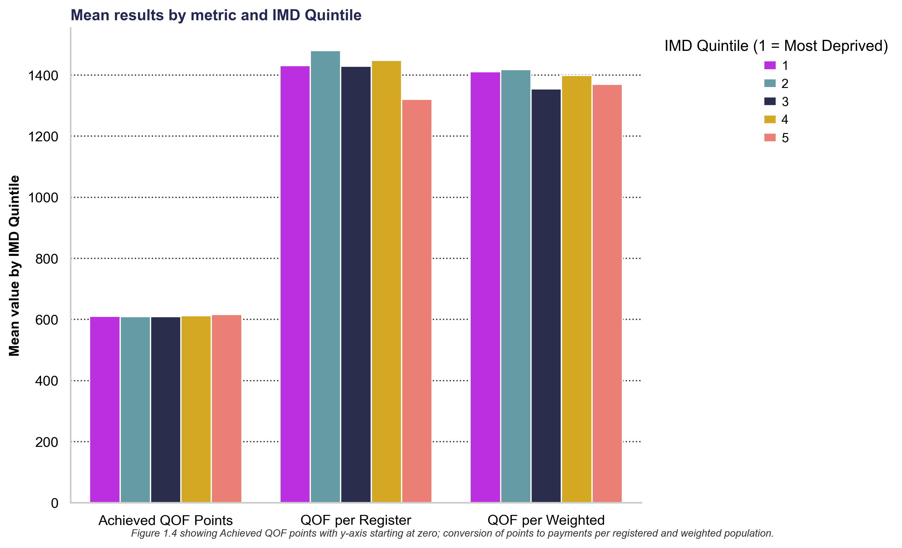
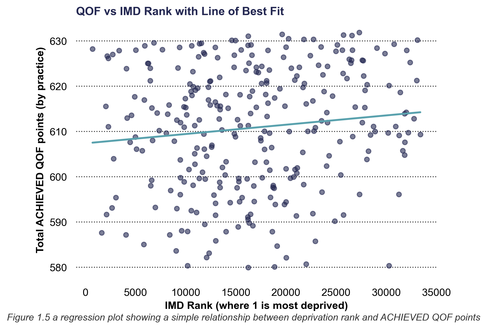
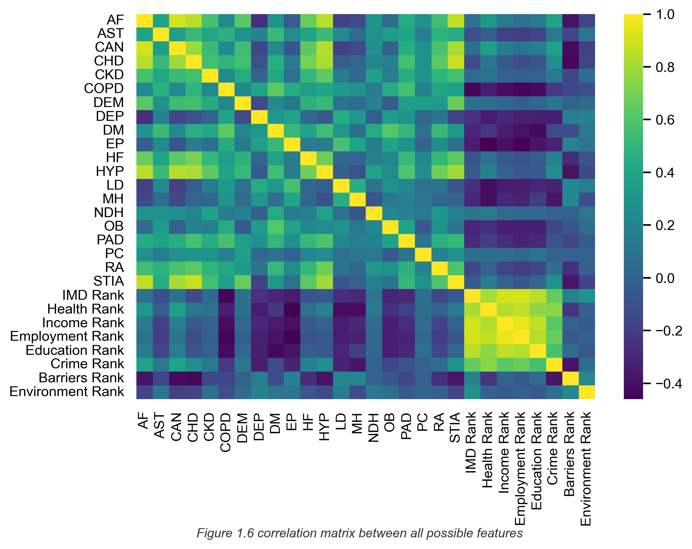

# Deprivation and GP Quality Outcome Payments

### Executive Summary
This project will look at the NHS’s voluntary Quality & Outcome Framework (QOF)

_“QOF rewards GP practices for the provision of 'quality care' and helps to fund further improvements in the delivery of clinical care. QOF points are achieved based on the proportions of patients on defined disease registers who receive defined interventions”_ (NHS Digital, 2023)

In 2023 the Health Equity Evidence Centre published a compelling online article called “Structural inequalities in primary care – the facts and figures” (Appel and Ford, 2023). This examined QOF and included the graph in figure 1.1 which appears to indicate more deprived GP practices achieve less QOF points. Thus QOF does not reduce inequality.

_Figure 1.1 The average QOF points when split by index of multiple deprivation quintile, showing fewer points awarded to the most deprived areas._

Note that in the figure 1.1 IMD quintile 1 relates to the least deprived, however this is not the industry standard and so within this study IMD Quintile 1 will relate to the most deprived.

QOF is designed to help with the additional workload associated with higher prevalence of disease it would perhaps be logical to speculate that perhaps higher prevalence would result in lower QOF achievement points. This would reduce the burden of inequality across the country: 

_“We think that incentives are a valuable tool for effectively allocating resources towards priority clinical areas. Some studies demonstrate that the introduction of QOF resulted in enhanced quality of care, reduced variation and better patient outcomes. They also consistently demonstrate that incentives lead to increased levels of recorded activity.”_ (UK Government, 2024)

Having defined a subset of the population (using data only from the South West of England), a linear regression model will be used, written in Python code and deployed in VSCode. The model will include both prevalence and IMD features. Metrics, such as RMSE, will be applied to the model created and assessed for goodness of fit. 

This project demonstrates that neither prevalence of disease nor deprivation reliably predict the number of QOF points achieved. It will also fail to recreate the evidence found in figure 1.1 and whilst a general trend may suggest a relationship it is not sufficiently consistent enough to support a regression model.

### Data Engineering
A variety of open source data will be used from multiple sources. Using the Government Data Quality Framework (The Government Data Quality Framework, 2020) the data quality will be assessed and the data joined, illustrated in figure 1.2 

*Figure 1.2 the data linkage model showing how 5 datasets are combined to create one wide dataset with Practice ID as the primary key. *

All data is for the financial year 2023/24, the latest available and ensures data timeliness.

The data sources are reputable and will have undergone strict data quality checks before national release. However, columns used within the model were checked for NA values (data completeness), data outside of possible limits (data validation) and the data type across the columns (data consistency) as per the Government Data Quality Framework (The Government Data Quality Framework, 2020). As expected, all tests were passed.

All joins were performed on a 1-1 basis, or many-1, in both instances the left hand dataframe in the join would contain the same number of rows as the target dataframe. This was checked before and after the join. An example being ‘QOF data with practice code’: ‘Postcode with Deprivation’ which is a many-1 join that will not include all rows from the ‘Postcode with Deprivation’ table.

Before joining to practice postcode data, a derived field name ‘ACHIEVED’ is created from the QOF Data and checked for data consistency, see figure 1.3 for code and output.

*Figure 1.3 code used to create aggregated (sum) field ‘ACHIEVED’ being the sum of all QOF points awarded across all domains.*

The data set is split into df_test and df_train,a random state is specified within the code to ensure that any analysis can be reproduced.  

### Data Visualisation
Initially figure 1.1 was recreated, as closely as possible, using the subset dataset. Instead of ‘Percentage of Max Points’ the ‘Achieved QOF Points’ was used (absolute value and not percentage of total). Figure 1.4 shows that while IMD Quintile 5 (least deprived practices) do indeed receive more points that IMD Quintile 1 (most deprived) the difference becomes minimal when the y-axis is drawn to zero. Furthermore, this effect is negated when the points are converted into monetary values.

This suggests that standard deviation will be low, figure 1.5 shows a regression plot between IMD Rank (a component of IMD Quintile) and ACHIEVED QOF points, the relationship does appear weak. 

Figure 1.6 illustrates the correlation matrix between all possible features. As a number of features are correlated >0.8 (using Pearsons Correlation) some features are dropped. Reducing the number of features protects against over-fitting the data. There is reduced correlation between the prevalence variables and the deprivation variables which all end with ‘Rank’.

### Data Analytics
Within Python the ‘statsmodels’ package was used. This package shares similarities with R syntax making it interpretable for a wider audience. The model was created using the ‘df_train’ dataframe and whilst the model summary is invaluable it does not test the df_test dataframe. A mixture of sklearn and numpy packages along with a locally defined function will be used to test the model.  

